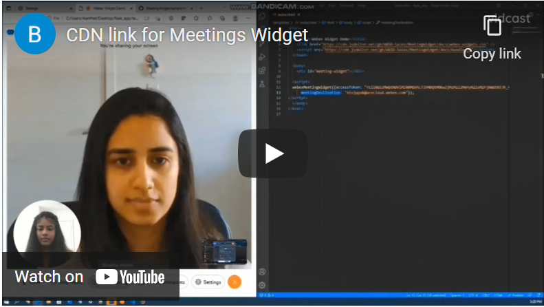
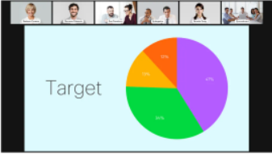

# Embeddable Meeting Widget
  
This project enables the user to embed the webex meetings widget with just a few lines of HTML code. Before this, if the user has to embed the webex meetings widget, he was able to do it only using react code. Now we have created CDN link for <a href="https://developer.webex.com/docs/widgets#meetings-widget-"><strong>Webex Meetings Widget</strong></a> which allows developers to easily include Webex meetings functionality into your application.

## Table of Contents

- [Video Demo](#video-demo)
- [Usage with CDN Link](#usage-with-CDN-links)
- [Properties](#properties)
  - [Access Tokens](#access-tokens)
  - [Meeting Destinations](#meeting-destinations)
  - [Theme](#theme)
  - [Draggable](#draggable)
  - [Remote Video Layout](#remote-video-layout)
    - [Grid (Default)](#grid)
    - [Overlay](#overlay)
    - [Stack](#stack)
    - [Prominent](#prominent)
    - [Focus](#focus)
  - [Customize Meeting Controls](#customize-meeting-controls)
    - [Meeting Controls when In Meeting](#meeting-controls-when-in-meeting)
    - [Meeting Controls when Not Joined yet](#meeting-controls-when-not-joined-yet)
- [Share screen compatible browsers](#share-screen-compatible-browsers)
- [Contact](#contact)


## Video Demo

[](https://youtu.be/clXqUCYBJnA, "Meetings Widget with CDN link Video Demo")

## Usage with CDN Links

Using our CDN requires the least amount of work to get started. Add the following into your HTML file in the head section:

```html
<link href="https://cdn.jsdelivr.net/gh/WXSD-Sales/embeddable-meetings-widget/docs/webex-widgets.css" />
<script src="https://cdn.jsdelivr.net/gh/WXSD-Sales/embeddable-meetings-widget/docs/bundle.js"></script>
```
You can then instantiate the widget by providing the following parameters:

```html
<div id="embeddable-meetings-widget"></div>
  <script>
  webexMeetingsWidget({accessToken : "ACCESS_TOKEN",
      meetingDestination : "MEETINGS_DESTINATION",
      theme : "light",
      draggable : true,
      width : "800px",
      height : "500px",
      layout : "Grid",
      inMeetingControls : ['mute-audio','leave-meeting'],
      interstitialControls : ['join-meeting']});
  </script>
```

## Properties

### Access Tokens

See the [Accounts and Authentication](https://developer.webex.com/docs/getting-started#accounts-and-authentication) section of our developer portal for more information on how to obtain access tokens.

### Meeting Destinations

A meeting destination is virtual location where the Webex meeting takes place.
A meeting destination can be accessed via:

* SIP URIs (Webex Meetings, Personal Meeting Rooms and Webex cloud-registered devices only)
* Email address (of a Webex user)
* [People IDs](https://developer.webex.com/docs/api/v1/people)
* [Room IDs](https://developer.webex.com/docs/api/v1/rooms)

### Theme

Developers can choose how widget should look based on following themes:

* Dark theme:
  * Use `theme="dark"` as prop value in Meetings widget.
* Light theme:
  * Use `theme="light"` as prop value in Meetings widget.

And if no theme is chosen it selects the browser's theme by default.

### Draggable

Developers can choose if the widget needs to be draggable or not by setting:

`draggable: true` if you want the widget to be draggable
`draggable: false` if you want the widget in a particular place

### Remote Video Layout

Remove video from participants can be displayed in many different ways.
Developers can choose how remote video displays based on the following layouts:

#### Grid (default)

Grid layout divides remote participants in equal segments, giving visibility to a lot of speakers at the same time.

Use `layout="grid"` as prop value in Meetings widget.


#### Overlay

Overlay layout displays the active speaker prominently, while overlaying other participants in a strip at the bottom.

Use `layout="overlay"` as prop value in Meetings widget.


#### Stack

Stack layout is similar to overlay, but instead of displaying other participants in a strip at the bottom,
non-active speakers are placed on top of the active speaker.
Stacking videos gives full visibility to everyone's video.

Use `layout="stack"` as prop value in Meetings widget.



#### Prominent

Prominent layout gives focus to the active speaker and displays other participants around this participant.

Use `layout="prominent"` as prop value in Meetings widget.


#### Focus

Focus layout gives all visibility to the active speaker.
All other participants are not displayed until they speak, who then would take over as active speaker.

Use `layout="focus"` as prop value in Meetings widget.


### Layout Styles

#### Width

The minimum width is set to 700px. Any width modifications above the minimum width will be applied.

#### Height

The minimum heoght is set to 500px. Any height modifications above the minimum height will be applied.

### Customize Meeting Controls

Developers can customize the meeting controls used by the Meetings widget.
The Webex Meetings Widget takes an optional function to specify a custom list of controls for a meeting and an optional range to specify which controls can be collapsed if not enough space is available.

#### Meeting Controls when In Meeting (inMeetingControls)

  * `mute-audio`
  * `mute-video`
  * `share-screen`
  * `member-roster`
  * `settings`
  * `leave-meeting`
 
#### Meeting Controls when Not Joined yet (interstitialControls)

  * `mute-audio`
  * `mute-video`
  * `settings`
  * `join-meeting`

## Share screen compatible browsers

Due to the use of the getDisplayMedia(), screen sharing is not available on mobile browsers and on Internet Explorer browser.\
It is [available on the following browsers](https://developer.mozilla.org/en-US/docs/Web/API/MediaDevices/getDisplayMedia#browser_compatibility): Chrome (v>=72), Edge (v>=79), Firefox (v>=66), Opera (v>=60), Safari (v>=13).

## Contact
Please contact us at wxsd@external.cisco.com
